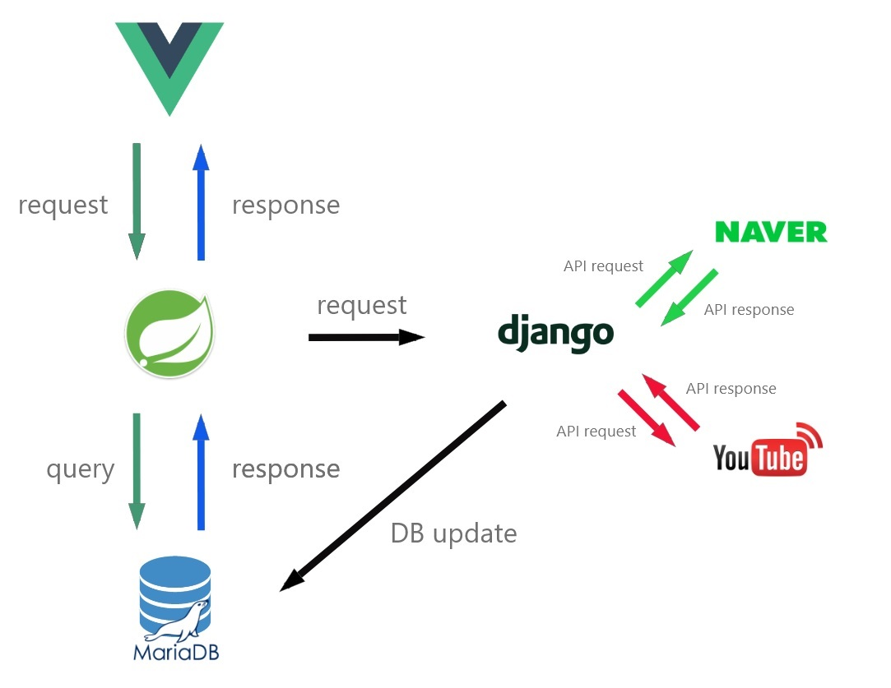

<strong>SSAFY 2기 1반 8조 프로젝트</strong>

# 유튜버 분석 서비스

:star: 페이지는 여기서 확인하세요! ​-> ​[:link:](http://15.165.77.1:3000/)

&nbsp;&nbsp;&nbsp;&nbsp;저희 서비스는 유튜버의 화제성을 분석하여 마케팅에 활용할 수 있도록 정보를 제공합니다. 유튜버가 다루는 토픽과 주제 뿐 아니라 여러 커뮤니티의 반응 및 기사들을 종합하여 유튜버에게 등급을 매깁니다. 기존에도 유튜버 분석 사이트는 존재했었습니다. 이들은 구독자수, 영상 조회수 등 만을 이용하여 높은 관심을 받는 유튜버를 보여줄 뿐입니다. 하지만 저희 사이트는 유튜버가 다루는 이슈와 사람들의 반응 등까지 복합적으로 다루며 유튜버의 색깔을 타 사이트보다 명확하게 보여줍니다. 이를 통해, 자신의 상품을 홍보하고 싶어 유튜버에게 광고를 의뢰하는 마케터는 유튜버에 대한 이해를 높일 수가 있게 되어 적절한 채널을 선택하는데 도움을 얻을 수 있습니다.

# 기술 아키텍쳐

 

&nbsp;&nbsp;&nbsp;&nbsp;저희 사이트는 2개의 서버를 운용합니다. 스프링과 장고가 그것입니다. 스프링은 뷰에서 사용자의 요청이 들어오면 이에 대해 응답을 보냅니다. 장고는 데이터를 업데이트하는 서버입니다. 사용자와 직접 통신하지는 않지만 자동화 알고리즘을 통해 DB를 항상 최신으로 유지합니다. 장고는 네이버와 유튜브의 API를 사용하여 정보를 갱신합니다.

# 개발 진행 사항

현재 브렌칭 상황입니다.

 

- `master` : 프로젝트의 최종 결과물 및 관련 문서들을 정리하였습니다.
- `develop` : 현재 개발 단계에 있어 master로 merge하기 전에 검토하는 브렌치입니다.
- `frontDev` : Vue의 개발 진행을 총괄하는 브렌치입니다. 세부 기능별 개발 브렌치를 가지고 있습니다.
- `backDev` : Spring의 개발 진행을 총괄하는 브렌치입니다. 세부 기능별 개발 브렌치를 가지고 있습니다.
- `dataDev` : django 서버 및 데이터 수집을 총괄하는 브렌치입니다. 세부 기능별 개발 브렌치를 가지고 있습니다.

### 조원

:sunglasses: 김주희

:cat: 김태민

:smirk: 박진홍

:cloud: 이상민

:zzz: 홍기환

